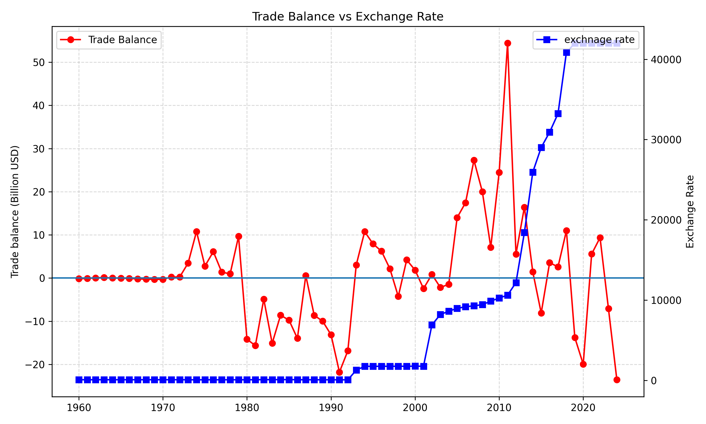
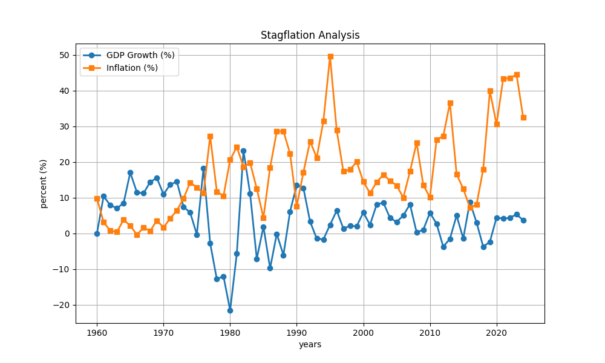
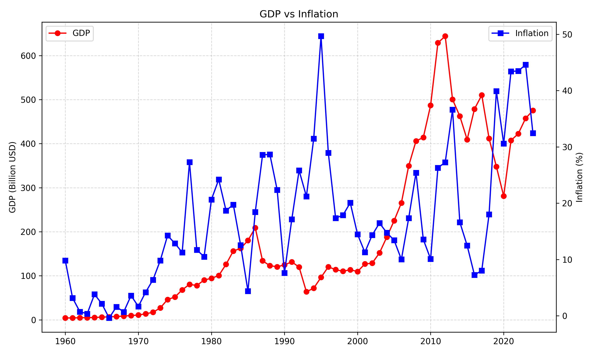

# Iran Macroeconomic Indicators Analysis (1960 - 2024)

## 📌 Project Overview
This project is a data-driven exploration of Iran's economic history. It was developed with two primary objectives:
1.  **Technical Proficiency:** Mastering data visualization using `Matplotlib` and data manipulation with `Pandas`.
2.  **Economic Insight:** Investigating the complex relationships between inflation, currency devaluation, and economic growth in a volatile landscape.

By transforming raw data into meaningful visualizations, this project aims to provide a clear picture of "Stagflation," "Trade Dynamics," and "Purchasing Power" over time.

---

## 📊 Key Economic Insights

### 1. Trade Balance vs. Official Exchange Rate
This analysis examines the **Currency Pass-through** effect. In theory, currency devaluation should boost the trade balance by making exports cheaper. 
*   **The Visualization:** A dual-axis chart comparing the Trade Balance (Billion USD) against the Official Exchange Rate.
*   **R&D Perspective:** This helps identify whether Iran's industry is "Export-oriented" or heavily "Import-dependent."

### 2. Stagflation Analysis (GDP Growth vs. Inflation)
Stagflation (High Inflation + Low Growth) is a critical challenge. This visualization identifies the periods where these two lines diverge sharply or converge in negative territory.
*   **The Visualization:** Overlapping time-series of GDP Growth Rate (%) and Inflation Rate (%).
*   **Insight:** Highlights the economic shocks and the resilience of the economy during different decades.

### 3. GDP Expansion vs. Inflationary Pressure
This chart explores the correlation between nominal GDP and the internal cost of living.
*   **Insight:** It distinguishes between nominal wealth creation and the erosion of value caused by persistent inflation.

### 4. Historical Trends of Individual Metrics
Detailed breakdown of GDP (in Billion USD) and Inflation trends to observe long-term cycles and the impact of global oil price fluctuations and international sanctions.

---

## 🛠 Technical Stack
*   **Language:** Python 3.x
*   **Libraries:** 
    *   `Pandas`: For data cleaning and feature engineering (calculating derived metrics like Trade Balance).
    *   `Matplotlib`: For advanced, customized plotting including dual-axis charts, custom grids, and markers.
    *   `NumPy`: For numerical operations.

## 🚀 Learning Journey
This project was a deep dive into **Data Storytelling**. Beyond just plotting lines, the focus was on:
*   Managing dual-axis plots for variables with different scales.
*   Formatting axes for large financial figures (Billion USD conversion).
*   Using visual markers to identify specific historical data points.
*   Understanding how data visualization serves as a decision-making tool in **Research and Development (R&D)** environments.

---

## 📂 Project Structure
- `data.csv`: The primary dataset containing Iran's economic indicators.
- `plots/`: Generated visualizations in PNG format.

---
*Developed as part of an economic data research and visualization study.*
